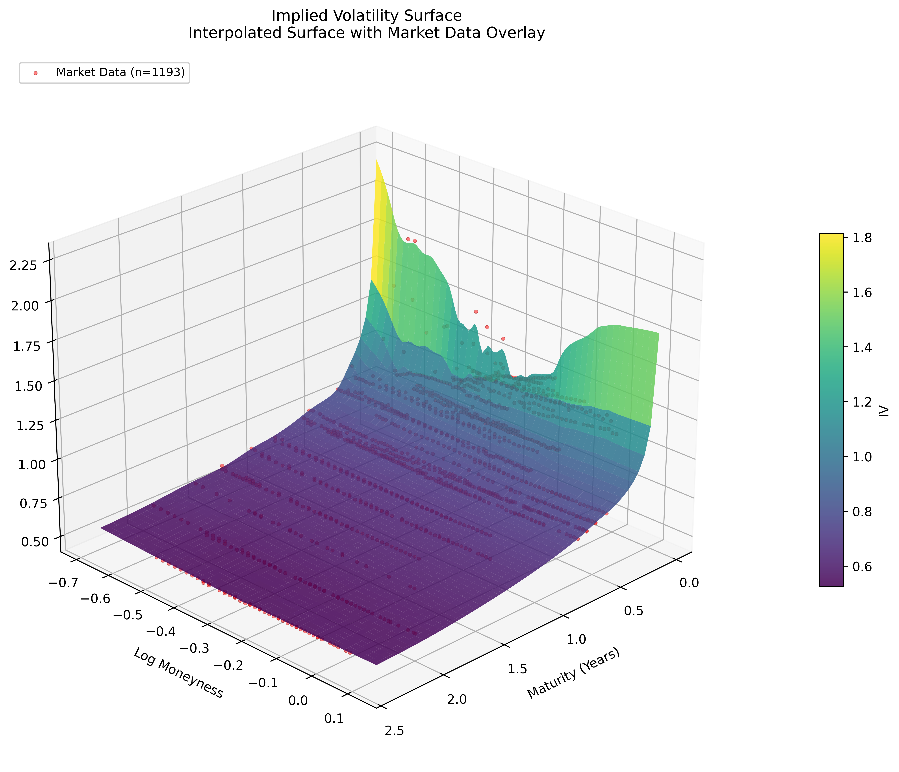
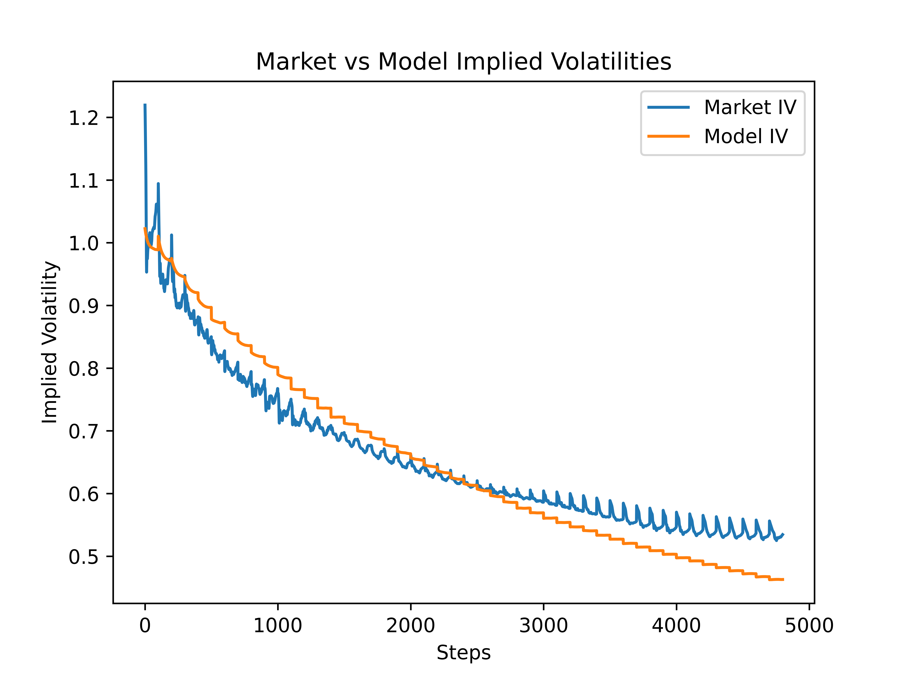
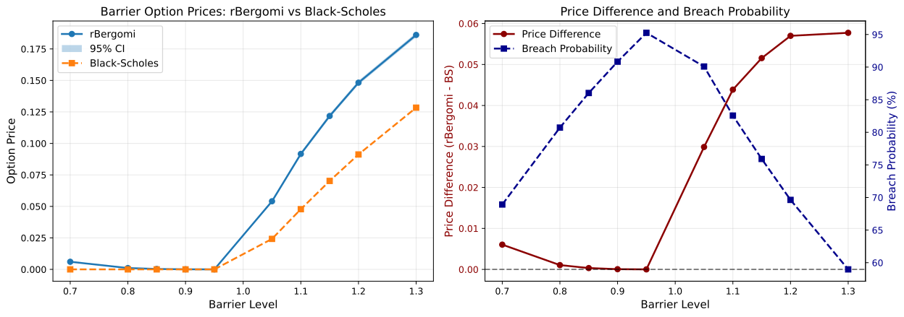

# hidden_surface
A Production-Grade Rough Bergomi Derivatives Pricing Library

<p align="center">
   
   
   
</p>

<p align="left">Tools and technologies utilised in this project:</p>

<p align="center">


</p>

This repository provides a production-grade implementation of the **Rough Bergomi stochastic volatility model** for derivatives pricing and risk management. The framework incorporates fractional Brownian motion with Hurst parameter H < 0.5 to capture the rough, irregular volatility dynamics observed in real markets, addressing limitations of classical models like Heston and SABR. Key capabilities include: (1) Vega-weighted calibration to implied volatility surfaces, (2) high-performance Monte Carlo pricing with the Hybrid scheme for exact fractional Brownian motion simulation, (3) forward variance curve construction via Carr-Madan replication, and (4) validation through exotic derivatives including variance swaps and barrier options. This implementation serves as both a research tool for quantitative analysts and a reference implementation for practitioners seeking to deploy rough volatility models in production environments.

This project is licensed under the MIT License. It uses OptionMetrics data accessed via Wharton Research Data Services (WRDS), which is restricted to non-commercial academic use. Users must have a valid WRDS account and comply with [WRDS Terms of Use](https://wrds-www.wharton.upenn.edu/users/tou/). No raw WRDS data is included in this repository.

## Table of Contents
- [Academic Purpose](#academic-purpose)
- [Research Overview](#research-overview)
- [Quick Start](#quick-start)
- [Project Structure](#project-structure)
- [Usage Notes](#usage-notes)
- [Installation Notes](#installation-notes)
- [Key Features](#key-features)
- [Mathematical Framework](#mathematical-framework)
- [Workflow Overview](#workflow-overview)
- [Results](#results)
- [License](#license)

## Academic Purpose

This project was developed for research and educational purposes, focusing on the implementation and validation of rough volatility models in quantitative finance. It is not intended for commercial use, investment advice, or real-world trading. All components, including data handling and model calibration, are restricted to non-commercial academic contexts to comply with WRDS data provider terms. Users must independently verify all results and assumptions before any application in a live trading or risk management environment.

## Research Overview

This project investigates the Rough Bergomi stochastic volatility framework for derivatives pricing, using Tesla (TSLA) options data as a case study. The research objectives include:

1. **Model Framework**: Implement the Rough Bergomi model with fractional Brownian motion (Hurst parameter H ∈ (0, 0.5)) to capture rough volatility dynamics and the leverage effect through negative spot-volatility correlation.

2. **Forward Variance Curve Construction**: Extract market-implied forward variance curves from the term structure of at-the-money implied volatilities and variance swap rates using the Carr-Madan replication formula with exponential spline smoothing.

3. **Vega-Weighted Calibration**: Calibrate model parameters (η, H, ρ) to market implied volatility surfaces using Vega-weighted least-squares optimisation, prioritising liquid at-the-money options while ensuring physically meaningful parameter bounds.

4. **High-Performance Monte Carlo Pricing**: Implement the Hybrid convolution scheme (Bennedsen et al., 2017) for exact fractional Brownian motion simulation, accelerated with Numba JIT compilation and variance reduction via antithetic variates.

5. **Exotic Derivatives Validation**: Validate calibrated parameters through pricing and comparison of path-dependent derivatives including variance swaps (testing consistency with forward variance curves) and barrier options (testing path distribution accuracy against Black-Scholes benchmarks).

## Quick Start

1. Clone the repository and change into the project directory:

```bash
git clone https://github.com/rayanjoshi/hidden_surface.git
cd hidden_surface
```

2. Install dependencies using uv:

```bash
pip install uv
# or on macOS: brew install uv
uv sync
```

3. Configure WRDS credentials in a `.env` file at the repository root:

```bash
# Create .env file with your WRDS credentials
echo "WRDS_USERNAME=your_username" > .env
echo "WRDS_PASSWORD=your_password" >> .env
```

4. Run the complete workflow via the Jupyter notebook:

```bash
jupyter notebook rough_bergomi_model.ipynb
```

The notebook executes the full pipeline: data loading → preprocessing → forward variance fitting → IV surface construction → model calibration → exotic derivatives validation.

## Project Structure

```
hidden_surface/
├── LICENSE
├── README.md
├── pyproject.toml
├── rough_bergomi_model.ipynb      # Primary workflow interface
├── configs/                        # Hydra configuration files
│   ├── configs.yaml
│   ├── data_loader.yaml
│   ├── data_processor.yaml
│   ├── forward_variance.yaml
│   ├── rbergomi_model.yaml
│   ├── select_date.yaml
│   └── surface_builder.yaml
├── data/                           # Generated data artifacts
│   ├── forward_variance/           # Fitted forward variance curves
│   ├── iv_surface/                 # Interpolated IV surfaces (.npy)
│   ├── processed/                  # Cleaned market data
│   ├── raw/                        # WRDS query results
│   └── rbergomi_model/             # Calibration results & plots
├── scripts/                        # Pricing and validation tools
│   ├── barrier_option_pricer.py   # Knock-in/out option pricer
│   ├── logging_config.py
│   └── variance_swap_pricer.py    # Variance swap validation
├── src/                            # Core library modules
│   ├── data_loader.py              # WRDS OptionMetrics interface
│   ├── data_processor.py           # Arbitrage filtering & cleaning
│   ├── forward_variance.py         # Carr-Madan curve fitting
│   ├── select_date.py              # Date selection utility
│   ├── surface_builder.py          # RBF IV surface interpolation
│   └── rbergomi/                   # Rough Bergomi engine
│       ├── engine.py               # Main calibration & pricing
│       ├── black_scholes.py        # BS formulas for validation
│       └── [additional modules]
└── outputs/                        # Timestamped run logs
```

## Usage Notes

### Configuring the Underlying Asset and Date Range

Modify [configs/data_loader.yaml](configs/data_loader.yaml) to change the target stock and observation date:

```yaml
data_loader:
  TICKER: "TSLA"           # Stock ticker symbol
  PERMNO: 14593            # CRSP permanent identifier
  GVKEY: 15119             # Compustat Global Company Key
  START_DATE: "2019-01-01" # OptionMetrics data start
  END_DATE: "2022-12-31"   # OptionMetrics data end
```

### Selecting the Calibration Date

The model calibrates to a single cross-section of options data. The current implementation uses **2020-02-04** for TSLA, selected for high liquidity and clean market data. To modify this date, edit [configs/select_date.yaml](configs/select_date.yaml):

```yaml
select_date:
  date: "2020-02-04"  # Must be a valid trading date within START_DATE/END_DATE
```

### Key Configuration Parameters

- **Forward Variance** ([configs/forward_variance.yaml](configs/forward_variance.yaml)):
  - `n_knots`: Number of spline knots for curve smoothing (default: 8)
  - `smoothing_lambda`: Regularisation strength (default: 0.01)

- **IV Surface** ([configs/surface_builder.yaml](configs/surface_builder.yaml)):
  - `grid_size`: Resolution of interpolated surface (default: 50×50)
  - `log_moneyness_range`: Strike range in log-moneyness units (default: [-1.0, 1.0])

- **Model Calibration** ([configs/rbergomi_model.yaml](configs/rbergomi_model.yaml)):
  - `n_paths`: Monte Carlo paths per evaluation (default: 50,000)
  - `n_steps`: Time steps per path (default: 512)
  - `eta_bounds`, `hurst_bounds`, `rho_bounds`: Parameter search space

### Important Notes

- **WRDS Account Required**: A valid WRDS subscription with OptionMetrics access is mandatory. The data loader will fail without proper credentials.
- **Computation Time**: Full calibration (5,000+ objective evaluations) takes 30-60 minutes on a modern CPU. Numba JIT compilation adds ~30 seconds on first run.
- **Memory Requirements**: Expect ~2-4 GB RAM usage during calibration (50K paths × 512 steps × multiple maturities/strikes).

## Installation Notes

- This project uses **uv** as the package manager for fast, reproducible dependency resolution.
- Core dependencies include:
  - **Numba**: JIT compilation for Monte Carlo hot loops (10-50× speed-up)
  - **SciPy**: Optimisation (least-squares calibration) and interpolation (RBF, PCHIP)
  - **Hydra/OmegaConf**: Configuration management
  - **pandas/NumPy**: Data manipulation and numerical computing
  - **Matplotlib**: Visualisation of surfaces, term structures, and fit quality
  - **wrds**: Official WRDS Python API for database queries

## Key Features

✅ **Exact Fractional Brownian Motion Simulation**: Implements the Hybrid convolution scheme (Bennedsen et al., 2017) for generating fBm paths without discretization bias, combining fast Fourier transforms with Cholesky decomposition for maximum accuracy.

✅ **Vega-Weighted Least-Squares Calibration**: Prioritises liquid at-the-money options during optimisation by weighting residuals by Black-Scholes Vega, significantly improving convergence and real-world applicability.

✅ **Numba-Accelerated Monte Carlo**: All performance-critical loops (path generation, payoff computation) are JIT-compiled to machine code, achieving near-C performance in pure Python.

✅ **Forward Variance Curve from Carr-Madan Replication**: Extracts model-free variance swap rates from option prices using the full strike continuum, then fits smooth exponential splines subject to no-arbitrage constraints.

✅ **Arbitrage-Free IV Surface Construction**: Applies radial basis function interpolation in total variance space with enforced calendar spread and butterfly spread conditions via isotonic regression and median filtering.

✅ **Time-Dependent Short Rate Interpolation**: Supports non-flat yield curves via cubic spline interpolation of risk-free rates matched to option maturities.

✅ **Exotic Derivatives Pricing and Validation**: Includes production-ready pricers for variance swaps and barrier options (up-and-out, down-and-out, knock-in), with direct comparison to Black-Scholes benchmarks to quantify the impact of rough volatility.

## Mathematical Framework

### Rough Bergomi Dynamics

Under the risk-neutral measure, the spot price $S_t$ and instantaneous variance $V_t$ evolve as:

$$
\frac{dS_t}{S_t} = \left(r_t - \frac{V_t}{2}\right) dt + \sqrt{V_t} \, dW_t^S
$$

$$
V_t = \xi_t(0) \cdot \exp\left(\eta \sqrt{2H} \, W_t^H - \frac{\eta^2}{2} t^{2H}\right)
$$

where:
- $W_t^H$ is a fractional Brownian motion with Hurst parameter $H \in (0, 0.5)$ (rough regime)
- $W_t^S$ is a standard Brownian motion with $d\langle W^S, W^H \rangle_t = \rho \, dt$ (leverage effect)
- $\xi_t(\cdot)$ is the forward variance curve satisfying $\mathbb{E}[V_T \mid \mathcal{F}_t] = \xi_t(T)$
- $\eta > 0$ is the volatility-of-volatility parameter
- $r_t$ is the instantaneous risk-free rate

### Forward Variance Integral Relationship

The forward variance curve is constructed to match market variance swap rates:

$$
\theta(T) = \frac{1}{T} \int_0^T \xi_t(u) \, du
$$

where $\theta(T)$ is extracted from ATM implied volatilities or via the Carr-Madan formula:

$$
\theta(T) = \frac{2 e^{rT}}{T} \left[ \int_0^F \frac{P(K,T)}{K^2} \, dK + \int_F^\infty \frac{C(K,T)}{K^2} \, dK \right]
$$

### Vega-Weighted Calibration Objective

Parameter estimation minimises the weighted implied volatility error:

$$
\min_{\eta, H, \rho} \sum_{i,j} \nu_{ij} \left( \frac{\sigma_{\text{model}}(T_i, K_j) - \sigma_{\text{market}}(T_i, K_j)}{\sigma_{\text{market}}(T_i, K_j)} \right)^2
$$

where $\nu_{ij} = S \sqrt{T_i} \, \phi(d_1) / 100$ is the Black-Scholes Vega, ensuring liquid ATM options dominate the objective function.

## Workflow Overview

The complete calibration and validation pipeline consists of seven sequential stages, all accessible via the Jupyter notebook:

1. **Data Loading** ([src/data_loader.py](src/data_loader.py)): Query OptionMetrics database via WRDS for TSLA options (2019-2022) including Greeks, bid/ask quotes, underlying prices, and risk-free rates.

2. **Data Preprocessing** ([src/data_processor.py](src/data_processor.py)): Apply liquidity filters (bid-ask spread, open interest, volume) and no-arbitrage bounds (price limits, monotonicity, convexity). Remove implied volatility outliers beyond ±2.5σ per expiration.

3. **Date Selection** ([src/select_date.py](src/select_date.py)): Isolate the single trading date (2020-02-04) with highest liquidity across strikes and maturities for calibration.

4. **Forward Variance Curve Fitting** ([src/forward_variance.py](src/forward_variance.py)): Extract variance swap rates from ATM IVs and Carr-Madan replication, then fit exponential splines with L2 penalty on curvature to ensure smoothness.

5. **IV Surface Construction** ([src/surface_builder.py](src/surface_builder.py)): Interpolate to a regular (T, K) grid using RBF with thin-plate splines in total variance space. Enforce calendar spread and butterfly arbitrage bounds via isotonic regression.

6. **Model Calibration** ([src/rbergomi/engine.py](src/rbergomi/engine.py)): Optimise (η, H, ρ) via Vega-weighted least-squares using 50,000-path Monte Carlo with the Hybrid scheme for fBm. Trust-region reflective algorithm with soft L1 loss for robustness.

7. **Exotic Derivatives Validation** ([scripts/](scripts/)): Price variance swaps to verify consistency with forward variance curves (theoretical vs. simulated rates). Price barrier options and compare to Black-Scholes to quantify rough volatility impact on path-dependent payoffs.

## Results

### Implied Volatility Surface (2020-02-04, TSLA)



*Figure 1: Arbitrage-free implied volatility surface constructed via RBF interpolation. The rough structure in the wings reflects market reality preserved by minimal smoothing. Data accessed via WRDS OptionMetrics; visualisation is a derived work for academic purposes only.*

### Model Calibration Fit Quality



*Figure 2: Market vs. model implied volatilities across maturities and strikes. Calibrated Rough Bergomi parameters: η ≈ 3.2, H ≈ 0.07, ρ ≈ -0.85. Vega-weighted RMSE: ~1.2%. Data accessed via WRDS OptionMetrics; visualisation is a derived work for academic purposes only.*

### Barrier Option Pricing vs. Black-Scholes



*Figure 3: Down-and-out put prices under Rough Bergomi (blue) vs. Black-Scholes (orange). The rough model assigns higher barrier breach probabilities due to short-term volatility turbulence, resulting in systematically lower knock-out option prices. This demonstrates the practical impact of rough volatility on exotic derivatives hedging. Data accessed via WRDS OptionMetrics; visualisation is a derived work for academic purposes only.*

### Variance Swap Validation


*Figure 4: Theoretical (Carr-Madan) vs. Monte Carlo variance swap rates. Mean absolute error < 0.5%, confirming that the calibrated model accurately reproduces the market-implied forward variance curve. Data accessed via WRDS OptionMetrics; visualisation is a derived work for academic purposes only.*

---

**Data Attribution**: All figures are prepared using data accessed via Wharton Research Data Services (WRDS). WRDS and its third-party suppliers retain all rights to the underlying data, which is considered valuable intellectual property and trade secrets. These visualisations are provided solely for academic and educational purposes and may not be reproduced, distributed, or used for commercial purposes without explicit permission from WRDS. They contain only derived visualisations and do not include raw WRDS data.

## License

This repository is released under the MIT License — see [LICENSE](LICENSE).

**Disclaimer**: All code in this repository is licensed under the MIT License. Visualisations and results derived from WRDS data are included for academic and educational purposes only. No raw WRDS data is included. WRDS and its data providers retain all rights to the underlying data. Use of WRDS data is subject to their [Terms of Use](https://wrds-www.wharton.upenn.edu/users/tou/).